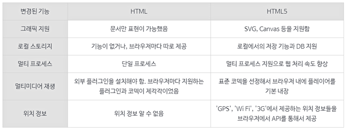

<h2>웹 디자인에 관한 것</h2>
<h3>개발 환경과 개발 도구</h3>
최초의 전자게임(1958)부터 현재(약 2020년)까지 인터랙티브 콘텐츠의 개발 도구는 컴퓨터다.  
개발을 하기 위해서는 보통 PC에서 '개발 환경(Development Environment)'을 구축하는 것이 필수적이다.  
초기 소프트웨어 개발 시스템은 코드 편집기, 컴파일링, 디버깅 등과 같은 개발 과정을 각각의 프로그램에서 사용했으며 콘솔을 통한 개발이 불가능했다.  
오늘날 통합개발환경은 개발자가 소프트웨어를 개발하는 과정에 필요한 모든 작업을 하나의 소프트웨어에서 처리할 수 있는 환경을 제공한다.  
 
대표적으로 이클립스, JDE, 안드로이드 스튜디오, 비주얼 스튜디오, 델파이, RStudio, 넷빈즈, 코드블럭스 등이 있으며, 가장 많이 사용되는 IDE는 IBM에서 개발한 이클립스와 마이크로소프트에서 개발한 비주얼 스튜디오이다.  
 
<h3>웹 프레임워크</h3>
웹 프레임워크(웹 어플리케이션 프레임워크)는 동적인 웹페이지나 웹서비스 개발하는 과정에서 DB연동, 템플릿, 코드 재사용등의 어려움을 줄이는 것이 목적인 프레임워크를 말한다.   
아키텍처는 보통 MVC (모델-뷰-컨트롤러) 패턴을 따라 사용자 인터페이스를 백 엔드를 분리한다.  
 
<b>CLI 기반</b> 
ASP.NET: 마이크로소프트사가 개발하여 동적인 웹사이트, 웹어플리케이션, 웹서비스를 만들 수 있게 도와주는 웹어플리케이션 프레임워크 
 
<b>PHP 기반</b> 
CodeIgniter(코드이그나이터): 2006년. 간편한 인터페이스와 논리적인 구조. 가벼움 
Laravel(라라벨): 2011년. 오픈소스 웹프레임워크. MVC 아키텍쳐. 모듈 방식의 패키징 시스템. 가장 대중적인 PHP 프레임워크 가운데 하나 
Symfony(심포니): 재사용이 가능한 PHP 구성요소/라이브러리들의 모임으로 스프링에 영향을 받았다. 
 
<b>JAVA 기반</b> 
Spring(스프링): 자바 플랫폼을 위한 오픈소스 애플리케이션 프레임워크. 대한민국 공공기관의 웹 서비스 개발 시 사용을 권장하는 전자정부 표준프레임워크 
스트럿츠: MVC 모델2에 기반한 프레임워크 
 
<b>Python 기반</b> 
Django(장고): MVC 패턴. 고도의 데이터베이스 기반 웹사이트를 작성하는데 용이. 안정화버전 : 2.0.1 (2018.01) 
┌ 장점: 강력한 라이브러리. 쉽고 간결.  
└ 단점: 모바일 환경에서 구현이 어렵다.   
 
<b>Ruby 기반</b> 
Ruby on Rails (루비 온 레일즈): 오픈 소스 웹프레임워크다. 데이터베이스를 이용한 웹 어플리케이션을 개발할 때 반복되는 코드를 대폭 줄여 개발시간을 단축한다.  
 
<b>JavaScript 기반</b> 
- 개발도구: 걸프(Gulp): 반복적인 개발작업을 자동화 시켜주는 자바스크립트 빌더 
- 라이브러리:  
jQuery(모든 브라우저에서 동작하는 클라이언트 자바스크립트 라이브러리. html의 ClientSide를 단순화한다. ),  
Paper.js,  
React JS,  
React Native,  
RequireJS,  
Rx JS,  
html2canvas(웹에서 화면을 캡쳐하는 기능),  
Webpack(여러 css, js 파일을 하나의 파일로 묶어 주는 자바스크립트 라이브러리) 
https://sanctacrux.tistory.com/978 
https://sanctacrux.tistory.com/221  
https://sanctacrux.tistory.com/219?category=360180 
 
<h3>웹 아트</h3>
웹을 통한 예술을 '웹 아트'라 한다. 웹아트는 그림, 텍스트, 애니메이션의 멀티미디어 정보로 이루어진 창이다.  
초기 웹아트 작가들은 1990년대 간편해진 인터넷 언어 코딩으로 누구나 개설 가능한 매우 사적이며 자유로운 표현공간을 만들었다.  
이들은 인터넷 사이트를 명확한 목적이나 정보나 지식을 전달하기 위한 사이트 아닌, 유희적인 기호와 시각 이미지로 가득한 놀이공간이 되도록 하였다.  
초기의 웹아트 작품으로는 〈장영혜중공업(http://www.yhchang.com)〉, 〈http://wwwwwwwww.jodi.org〉 등이 있다.  
 
<h3>웹 기본 구조</h3>
웹의 기본적인 구조는 HTML(.html) + CSS(.css) + 스크립트, 즉 Javascript(.js)로 이루어진다.  
 
HTML(HyperText Markup Language)은 웹페이지에 내용을 기술하고 정의하는 데 사용한다.  
파일 확장자는 '.html', '.htm'이다.  
2020년 기준 현재 사용되고 있는 웹 표준인 HTML5는 W3C에서 개발했으며, 2014년 10월 28일 발표했다.  
참고로 HTML5는 HTML과 다르지 않다.  
하지만 엄밀히 따지면, 웹을 지탱하는 핵심 기술은 HTML이며, 모바일 웹의 핵심 기술은 HTML5라 할 수 있다.  
흔히 HTML5에 대한 폭발적인 관심을 불러일으킨 데에는 플래시(Flash)와 관련된 스티브 잡스의 발언이 그 출발이라 여겨진다.  
HTML5는 HTML의 새로운 버전으로 'Client Side Technology' 기술의 중심이 되는 마크업 언어다.  
가장 특징적인 것은, 기존의 웹 문서에서는 HTML 만으로 웹 서비스를 구성하는 것이 불가능하였지만 HTML5로 넘어오면서 클라이언트와 서버와의 통신이 가능하며 이에 대한 부가 기능을 제공함으로써 다른 외부 'Active-X'와 같은 플러그인을 사용하지 않고도 웹 서비스를 제공할 수 있을 정도로 많은 기능이 추가되었다는 것이다.  
HTML5는 'Client Side Technology'를 강력하게 지원하는 단순 표현 HTML을 그 이상의 의미를 가지도록 더 높은 차원으로 발전시킨 기술이다.  
즉, 기존의 HTML은 HTML 4.0 이후에도 W3C에 의해서 HTML 4.01, XHTML 1.0, 1.1, 2.0 등으로 발전해 왔지만 이런 그동안의 HTML 에서의 한계를 극복하기 위해 HTML5 가 탄생하게 된 것이다.  
HTML5에서는 크게 차세대 웹 표준으로 HTML이 멀티미디어 등 다양한 애플리케이션까지 제공하도록 바뀌었다.  
이제는 HTML5로만 개발하기 때문에 HTML5보다는 HTML이라 말하는 추세다.  
자세한 내용은 <a href="./html5.md">HTML5</a> 문서에 정리해두었다. 
 
  
 
CSS(Cascading Style Sheets)는 웹페이지 콘텐츠의 모양이나 표현을 기술하는 데 사용한다.  
Javascript(자바스크립트)는 브라우저에서 실행되는 프로그램 언어다.  
사용자의 행동에 화면이 반응하는 것과 같은 동적인 기능을 웹페이지나 애플리케이션에 넣기 위해 사용한다.  
현재 Node.js를 통해 서버 상에서도 자바스크립트를 구현할 수 있게 되었다.  
이 중 Javascript는 구성 요소들의 위치, 크기 움직임 등을 사용자가 원하는대로 지정할 수 있도록 한다.  
특히 앨리먼트(HTML Elements)는 그래픽을 위한 컨테이너로, 패스, 박스, 원, 텍스트, 이미지 등을 그릴 수 있다.  
앨리먼트의 구조는 다음과 같다.  
<code><"태그이름">"콘텐츠"<"/""태그이름"></code>
 
또한 앨리먼트 구성요소에는 javascript를 통해 반응하는 그림도 그릴 수 있다.  
이러한 앨리먼트 내에 쉽게 그림을 그릴 수 있도록 하는 라이브러리들이 있다.  
paperjs, processingjs, konvajs, fabricjs, HTML Canvas Javascript Library 등이 있다.  
 
직접 개발을 하지 않더라도 플러그인이나 다양한 자바스크립트 라이브러리를 활용하여 충분히 원하는 그래픽을 구현할 수 있다.  
이 외에도 자바스크립트를 이용할 수 있는 어도비사의 프로그램도 있다.  
인디자인, 일러스트레이터 등 ...  
 
<h3>웹 관련 디자인</h3>
 디자인 포지션에는 굉장히 다양한 종류가 있다.  
  UX 디자이너와 UI 디자이너, UX/UI 디자이너, UI/UX 디자이너 등은  모두 이름은 비슷해보이지만 각각 다른 포지션이다.  
  프로덕트 디자이너, 인터랙션 디자이너, 서비스 디자이너, 비주얼 디자이너, 디자인 리서처 외에도 비즈니스 전략 디자이너, 브랜드 디자이너, 산업 디자이너 그외 수많은 포지션이 존재한다.  
   
  이 모든 포지션을 다루기에는 분량이 너무나도 광범위하다.  
  따라서 큰 범위에서 해당 분야를 '디지털 디자이너'라 불릴 수 있는, 주로 다루는 서비스나 제품이 디지털의 영역에 한정된 포지션을 위주로 다루고자 한다. 
 
  <h3>UX 디자인</h3>
  UX 디자이너의 실무에서의 주요 역할은 크게 디자인 리서치와 유저 워크플로우 분석이다.  
  그 후 와이어 프레임을 만들고 어느 정도 수준의 프로토타입(Low-fidelity)를 만드는 역할까지다.  
  제품이 만들어지기까지의 주로 앞단 부분을 도맡아서 한다.  
   
<h3>UI 디자인</h3>
  UX 디자인과 UI 디자인의 차이를 헷갈려하는 경우가 많다.  
  두 포지션 간에는 차이가 없다고 말하는 사람들도 있지만 엄연하게 따지면 분명히 다른 포지션이다.  
  차이가 없다고 느껴지는 것은 그 포지션에 대한 회사의 이해도 부족과 그로 인한 직함에 대한 잘못된 사용, 혹은 예산을 줄이기 위해 한 명의 디자이너에게 다양한 기술들을 요구하기 때문이다.  
   
  UI 디자이너의 실무에서의 역할은 UX 디자이너가 짜 놓은 워크플로우와 프로토타입을 바탕으로 화면의 레이아웃을 잡고 칼라와 폰트, 그 외의 모든 디자인 컴퍼넌트들을 완벽한 픽셀로 디자인하는 역할이다.  
  UX 디자이너가 앞단을 도맡아서 한다면 UI 디자이너는 뒷단을 책임지는 역할이다.  
  그래서 최종적으로는 High-fidelity의 프로토타입을 만들고 목업까지 만드는 작업을 한다.  
  그리고 최종적으로 프론트엔드 개발자와 커뮤니케이션을 하면서 실수로, 혹은 설명이 부족해서 발생될 수 있는 실수들을 없애고, 최종적으로 제품에 Implement가 될 수 있도록 같이 만들어가는 역할을 한다.  
  
  하지만 UX 디자이너의 역할과 UI 디자이너의 역할을 완전히 분리하는 것은 사실상 효율성이 떨어지고 UX에 대한 기본적인 이해 없이는 결코 디테일한 스크린상에서의 사용성을 고려할 수 없기 때문에 대부분 뭉뚱그려서 UX/UI 디자이너의 포지션을 만들어 낸 것이다.  
  근래에는 디자인 시스템으로 인하여 UX 디자이너에게는 완벽한 픽셀 디자인을 만들어 낼 수 있는 기술, 즉, 폰트와 색사용, 레이아웃 디자인 등에 대한 이해도를 필요로 하며, UI 디자이너에게는 더 나은 사용성과 효율성을 위한 시스템 중심의 디자인 접근 방법과 구조적 사고를 요구한다.  
   
  UI 디자이너들 대부분의 특징은, 그래픽 혹은 비주얼 디자인을 전공했던 사람들이 대부분이며 그 이전에는 웹 사이트를 전문적으로 제작하던 많은 그래픽 디자이너들이 UI로 전향했다.  
   
  <h3>인터페이스 디자인: UX/UI 디자인 vs. UI/UX 디자인</h3>
  순서만 다르게 쓴 것이 아닐까 생각할 수 있지만, 엄밀히 따지만 앞에 쓰인 것에 베이스를 두고 뒤에는 서브하는 역할을 하는 것이다.  
  예를 들어 UX/UI 디자이너 포지션은 강점을 UX에 두었으면서 UI 디자인도 어느 정도 가능한 역할이고, 반대로 UI/UX 디자이너는 UI에 강점을 가지고 있고 UX 디자인에 대한 어느 정도의 이해를 가지고 있는 것이다.  
  사실상 이미 UX와 UI 디자이너의 겨예가 서로 엉키고 설켜있어서 큰 차이나 의미는 없다.  
   
<h3>웹 디자인</h3>
웹 디자인은 웹 브라우저가 해석하고 그래픽 사용자 인터페이스(GUI)로 보여주기에 알맞은 마크업 언어(markup language) 형식으로 인터넷을 통해 전자 매체 콘텐츠 전달의 개념을 정하고 계획하고 모델로 만들어 실행하는 과정이다.  
마크업 언어란 태그 등을 이용하여 문서나 데이터의 구조를 명기하는 언어의 한가지다.  
태그는 원래 텍스트와는 별도로 원고의 교정부호와 주석을 표현하기 위한 것이었으나 용도가 점차 확장되어 문서의 구조를 표현하는 역할을 하게 되었다.  
이러한 태그 방법의 체계를 마크업 언어라고 한다.  
주요 마크업 언어로는 SGML, HTML, XML, XHTML, SVG, MathML, MXML, XAML 등이 있다.  
웹 사이트에는 잔자 파일이 한데 모여 있다.  
HTML/XHTML/XML 태그를 사용하는 페이지 위에 텍스트, 비트맵 그림(GIF, JPEG, PNG), 폼(Form)과 같은 요소를 추가할 수 있다.  
벡터 그래픽스, 애니메이션, 비디오, 소리와 같은 복잡한 미디어를 보여줄 때는 플래시, 퀵타임, 자바 런타임 환경 등과 같은 별도의 플러그인을 요구한다.  
플러그인은 HTML/XHTML 태그를 사용함으로써 웹 페이지에 추가할 수 있다.  
W3C표준과 호환되는 브라우저는 웹 페이지 요소와 객체의 위치를 정하고 이용하기 위해 CSS와 XHTMLXML의 결합을 촉진시켰다.  
W3C(World Wide Web Consortium, WWW 또는 W3)는 웹(또는 월드 와이드 웹)을 위한 표준을 개발하고 장려하는 조직으로 팀 버너스 리를 중심으로 1994년 10월에 설립되었다.  
W3C는 회원기구, 정직원, 공공기관이 협력하여 웹 표준을 개발하는 국제 컨소시엄이다.  
W3C의 설립취지는 웹의 지속적인 성장을 도모하는 프로토콜과 가이드라인을 개발하여 월드 와이드 웹의 모든 잠재력을 이끌어 내는 것이다.  
W3C가 제정한 WWW 관련 표준 목록에는 CSS, CGI, DOM(Document Object Model: 문서 객체 모델), HTML, RDF, SVG, SOAP, SMIL, WSDL, XHTML, XML, XPath, XQuery, XSLT 등이 포함되어있다.  
 

 
<h3>웹 디자인vs. UI 디자인</h3>
웹 디자이너는 페이지에 보여지는 모든 디자인 요소를 디자인하고 구성하는 일을 한다.  
이는 이미지, 텍스트, 링크 등의 그래픽 인터페이스 제작과 배치부터 이를 웹에 얹기 위한 html/css 코딩 등의 작업까지 포함한다.  
 
인터페이스란 기계와 사람이 만나는 공간 혹은 사물과 컴퓨터의 하고자 하는 말을 사용자에게 전달하는 화면을 말하며, 사용자가 하고자 하는 말을 컴퓨터에게 전하는 키보드 등도 인터페이스의 한 사례다.  
 
UI 디자인은 기기와 이를 사용하는 사용자 사이를 연결해주는 화면의 인터페이스를 디자인하는 작업이다.  
현재 보고 있는 화면이 웹 페이지라면 웹의 인터페이스를 디자인하는 것이고, 어플리케이션이라면 휴대폰 규격의 화면을 디자인하는 일이 되는 것이다.  
 
웹 디자이너에게는 디자인 역량과 디자인 요소를 웹에 얹기 위한 개발언어 스킬이 필요하다면, UI 디자이너에게는 프로토파이, 어도비 XD 등 프로토타이핑(개발되기 전에 간단하게 제작된 목업 버전) 툴 활용과 UI를 잘 설계할 수 있는 정보 정리 능력이 필요하다는 점에서 차이가 있다.  
 
일반적으로 UI/UX 디자이너를 뽑는 회사에서 요구하는 역량으로는 Adobe XD, Sketch, Illustrator, Zeplin, Protopie 등의 GUI 구현을 위한 디자인 소프트웨어 사용능력과 디지털 프로덕트(Web, Android, iOS) 설계에 대한 이해, 구글 머테리얼 디자인, 애플 휴먼 인터페이스 가이드라인 숙지, 그 외 정성/정량적 고객 피드백을 분석하여 UI/UX를 제시할 수 있는 능력, 프로토타이핑을 통해 아이디어를 구체화하고 커뮤니케이션할 수 있는 능력 등이 있다.  
   
  결론적으로, 웹 디자이너는 브랜드의 상품, 서비스를 소개하는 것이 주목적인 홈페이지, 상세페이지 등을 디자인, 구성, 코딩하는 일을 하고, UI 디자이너는 디바이스 혹은 기기 속의 서비스(앱)을 사용하는 사용자의 경험을 더욱 편리하게 하는 것을 목표로 인터페이스 속 정보를 직관적으로 구조화하고 그것을 구성하는 그래픽 요소를 디자인하는 일을 한다.  
  이 둘은 다른 역량이 요구되는 직업이며, 앞으로 점점 웹에서 앱으로 넘어가는 트랜드이므로 더 많은 회사에서 웹 디자이너 보다는 UI 디자이너를 고용할 것이다.  
   
<h3>웹 디자인vs. 프론트엔드</h3>

<h3>웹 디자인vs. 웹 퍼블리싱</h3>
퍼블리싱은 웹 사이트를 제작할 때, 웹 디자이너가 디자인 한 것을 웹 표준성과 접근성에 부합하도록 재정리하는 것이다.  
퍼블리셔는 앞서 설명한 퍼블리싱을 목표로 웹 디자인 작업과 함께 코딩으로 웹 사이트를 제작하고 편집하는 일을 한다.  
사실 퍼블리셔는 우리나라에서만 사용하는 단어로, 프론트엔드 개발자와 구분짓기 위해 사용된다.  
퍼블리셔가 되면 주로 html과 css 중심의 업무를 담당하게 되는데, 최근 들어서는 js의 중요도가 높아짐에 따라 js를 다루는 사람들이 많이지고 있다.  
 
프론트엔드 개발자가 퍼블리셔와 다른 점은 크게 네 가지로 볼 수 있다.  
첫째, 더 동적인 화면을 구사한다.  
이를테면 사용자가 ID나 Password를 입력했을 때, 그것이 유효한지 확인해야 하는데, 만약 잘못된 ID를 입력했다면 상황에 따른 알림을 주는 역할을 하게 된다.  
둘째, 실제 작동 가능한 웹 페이지를 구현한다.  
프론트엔드 개발자는 API를 웹 페이지에 적용하고 벡엔드와 연동되는 실제 작동 가능한 웹 페이지를 구현하게 된다.  
셋째, 크로스 브라우징, 웹페이지의 호환성, 페이지의 개선 등을 맡는다.  
단순히 퍼블리싱하는 것에서 나아가 웹 사이트 전반에 대해 관리하고 유지 보수하는 일까지 맡는다고 볼 수 있다.  
 

